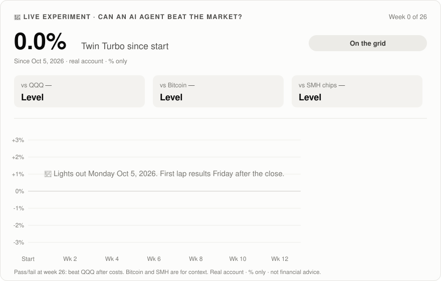

# 🏎️ TWIN TURBO: a two-engine momentum trading agent

### *Claude Cowork 🤝 Interactive Brokers · 💥 Boomer rides the leaders, ⚡ Booster buys their dips.*

**Twin Turbo** 🤖 runs before every market open, does the math, writes your 📝 order tickets, and sends you a 📬 fun email.
**You approve every trade yourself in IBKR.** The agent never pulls the trigger. 🔒

## 🔴 Live: does it actually work?

Twin Turbo has been trading a **real (small) account** under exactly these rules since **Oct 5, 2026**. The scoreboard updates every Friday after the close, **% only**.



<!-- PIT-REPORT:START -->
### 🏁 Pit Report
*Lights out Monday Oct 5. First lap results arrive Friday Oct 9 after the close.*
<!-- PIT-REPORT:END -->

**[📒 Full race log →](LIVE.md)** · 🧪 Pass/fail at week 26: beat QQQ after costs. Bitcoin and SMH are shown for context.

> 🎮 **A trading sandbox, not your retirement plan.** Use a **separate, small account** you're OK playing with.
>
> ⚠️ **Not financial advice.** You can lose money (the backtest below had a −34% drawdown). Read the [fine print](#️-the-fine-print). 🧪 Start on a paper account.

---

## 🧠 Why two engines?

We tested a lot of "fast trading" ideas, and most of them **lost money after costs**: tight stops, 5-day swing trades, intraday dip-buying. The two things that held up on a fair test were:

| Engine | Share | What it does | Pace |
|---|---|---|---|
| 💥 **BOOMER** | **70%** | Every Monday it holds the **5 strongest stocks** by 3-month return. It keeps a winner while it stays in the top 10. | ~1–2 trades/week |
| ⚡ **BOOSTER** | **30%** | Buys **sharp 1–3 day dips in the top-15 leaders**, then sells into the bounce. Up to 3 slots. | ~2–3 trades/week |

**Together: about 4 trades a week**, all from rules, no vibes. 🎯

---

## ⚡ Launch sequence (about 15 min)

| Step | Do this |
|---|---|
| 1️⃣ 🔌 | **Connect** in Claude (Settings → Connectors): **Interactive Brokers** (required) and **Gmail** (for the email; optional) |
| 2️⃣ 🗂️ | **Create a Cowork project.** Name it after your agent. |
| 3️⃣ 📋 | **Paste this** into a new session: *"Set me up from this guide: https://github.com/OmarTokens/twin-turbo-trader. Ask me the 3 questions, save the engine and my config to the project, then do a dry run with a sample email. No orders yet."* |
| 4️⃣ ⏰ | **Say "schedule it."** It runs weekdays at **~8:50 am ET** (pre-market). Turn on **"Automatically approve"** in the scheduled task's settings if it's offered. |
| 5️⃣ ☕ | **When the email lands (~9:15):** open IBKR → Orders → Instructions, **Submit** ✅ or **Delete** ❌ each one before or during the trading day |

> 💡 **Check your IBKR commission plan.** On a small account, a $1 minimum per order eats the Booster's edge. **Tiered** ($0.35 minimum) added about **+30 points** in the test. Lite ($0) helps a bit more.

---

## 🎯 Just 3 questions

### 1 · 💰 How much?
The amount in your trading account: $____. *A paper account or $2–10k is plenty to learn.*

### 2 · 🎚️ Which mix?

| | 🏎️ **Twin Turbo** *(default)* | 💥 **Full Boomer** | ⚖️ **Even Split** |
|---|---|---|---|
| Mix | 70% Boomer / 30% Booster | 100% Boomer | 50% / 50% |
| Trades/week | ~4 | ~1.6 | ~5 |
| Backtest return (Aug 2022 → Oct 2026)* | +259% | +325% | not re-tested |
| Max drawdown* | −34% | −39% | not re-tested |
| For you if… | You want action + the main engine | You want the max and can stomach big swings | You care more about activity than return |

<sub>*Fair-universe backtest, tiered commissions. See [the evidence](#-the-evidence-and-its-limits).</sub>

### 3 · 🎤 Email vibe?
🎤 Hype coach · 🏁 F1 race engineer · 📈 Wall St veteran · 🏄 Chill surfer · 🎙️ Sports commentator · 🏴‍☠️ Pirate · 🕶️ Secret agent · 🧊 Plain · ✍️ *invent your own*

---

## 💥 Boomer: the rules

| Rule | Setting |
|---|---|
| 🗓️ **When** | The first trading day of each week |
| 📊 **Rank** | Every stock in the universe by **3-month return**. Only names **above their 50-day average** qualify. |
| 🏆 **Hold** | The **top 5**, about 14% of the account each |
| 🧲 **Keep** | A holding stays while it's still in the **top 10** (cuts pointless churn) |
| 🚪 **Sell** | When it drops out of the top 10 or falls below its 50-day average |
| 🌧️ **Bad weather** | If **QQQ is below its 200-day average**, hold only the top 2 and keep the rest in cash |

## ⚡ Booster: the rules

| Rule | Setting |
|---|---|
| 🎯 **Hunting ground** | Only the **top-15 momentum names** that are above their 200-day average (dips in leaders, not falling knives) |
| 📉 **Signal** | **RSI(2) below 10** (a sharp 1–3 day selloff) |
| 💵 **Entry** | A **limit buy 1% below yesterday's close**, DAY order. If it doesn't fill, no trade. That's on purpose. |
| 📦 **Size** | Up to **3 slots**, about 10% of the account each |
| 🚀 **Exit** | When **RSI(2) climbs above 70** (the bounce is done) |
| ⏱️ **Time stop** | After **10 trading days**, regardless |
| 🛑 **Stop** | A close **8% below entry** (the agent also sets a price alert) |
| 📅 **Earnings** | No dip-buys within 2 trading days of a report |

## 🧯 Brakes

- **−20% from the peak** → no new Booster buys
- **−35% from the peak** → the agent proposes going all-cash and waits for you

---

## 🗺️ The universe: 63 names

This is a **fixed list**, chosen the way you would have in 2022 (the Nasdaq-100 plus that year's hot retail names), **including the ones that crashed afterwards**. Don't add today's hottest stock; that's how backtests lie. 🙃

`AAPL` · `ABNB` · `ADBE` · `ADSK` · `AFRM` · `AMAT` · `AMD` · `AMGN` · `AMZN` · `ASML` · `AVGO` · `BKNG` · `COIN` · `COST` · `CRWD` · `CSCO` · `DDOG` · `DKNG` · `DOCU` · `DXCM` · `EBAY` · `FTNT` · `GOOGL` · `HOOD` · `INTC` · `INTU` · `ISRG` · `KLAC` · `LCID` · `LRCX` · `LULU` · `MELI` · `META` · `MRNA` · `MRVL` · `MSFT` · `MSTR` · `MU` · `NET` · `NFLX` · `NVDA` · `OKTA` · `PANW` · `PDD` · `PEP` · `PLTR` · `PYPL` · `QCOM` · `RBLX` · `RIVN` · `ROKU` · `SBUX` · `SHOP` · `SMCI` · `SNOW` · `SNPS` · `SOFI` · `TSLA` · `TXN` · `UPST` · `WDAY` · `ZM` · `ZS`

✂️ **Make your own call:** remove anything you don't want to own (some people skip defense, crypto, or China names). Keep it **50+ names** and **decide before you look at recent charts**.

---

## 📬 The Pit Report

**Sample 🏁 (F1 race engineer):**
> **Subject: 🏁 Twin Turbo — Mon Oct 5 — 3 to submit**
>
> Box, box! Monday is pit-stop day for Boomer. QQQ is above its 200-day line: track is dry. ☀️
>
> 🔴 **SELL — XYZ** · BOOMER · fell out of the top 10 · `qty 2.1 · limit $—`
> 🟢 **BUY — ABC** · BOOMER · momentum #2, 3m +48% · `qty 1.4 · limit $—`
> ⚡ **BUY — DEF** · BOOSTER · RSI(2) 4, a dip in a top-15 leader · `qty 3.0 · limit $— (−1%) · stop −8% · exit RSI(2) > 70 or 10 days`
>
> 🏎️ **Garage:** 7 holdings · week +1.2% vs QQQ +0.8%
> 👀 **On the radar:** GHI (RSI(2) 14), JKL (RSI(2) 19)
>
> Tickets are waiting in IBKR. Submit or shred them. — **Twin Turbo** 🏎️
> <sub>Automated output from your own tool, not financial advice. You make every call.</sub>

**Remix anytime:** `email vibe pirate` 🏴‍☠️ · `email shorter` · `email no jokes`

---

## 🎛️ Mission control

| If… | Say |
|---|---|
| 👀 You want a quick picture | `status` |
| 🤔 Why this trade (or none)? | `explain <TICKER>` / `why no trades?` |
| 🎚️ Change the mix | `mix 70/30` · `mix 100/0` · `mix 50/50` |
| ✂️ Edit the universe | `remove <TICKER>` *(adding is discouraged; see above)* |
| 🏖️ Take a break | `pause` / `resume` |
| 📈 Weekly check-up | `review` *(automatic every Friday)* |

🏆 **Golden rule:** **don't tweak for 12 weeks.** Momentum has long cold spells, and the big winners come rarely. Bailing after a bad month is how this strategy loses.

---

## 📊 The evidence (and its limits)

**Setup:** daily bars from IBKR, Aug 1 2022 → Oct 2 2026, a $4,010 start, 0.1% slippage each way, signals on the prior close, trades the next day.

| Strategy | Total | Max drawdown | Trades/week |
|---|---|---|---|
| 🏎️ **70% Boomer + 30% Booster** (tiered commissions) | **+259%** | −34% | 4.2 |
| 70/30 with $1-minimum commissions | +230% | −35% | 4.2 |
| 💥 100% Boomer (top 5) | +325% | −39% | 1.6 |
| ⚡ 100% Booster | +75% | −33% | 2.6 |
| QQQ held | +138% | −23% | – |
| ❌ Our earlier fast swing rules (3-month test) | −15% | −20% | 9 |

**By year (70/30):**

| | 2022 (Aug–Dec) | 2023 | 2024 | 2025 | 2026 YTD |
|---|---|---|---|---|---|
| 🏎️ Twin Turbo | −6.5% | +44.7% | +46.2% | +15.1% | +57.5% |
| QQQ | −15.6% | +53.8% | +24.8% | +20.2% | +22.0% |

**Read this before you get excited:** 🧐
- It **beat QQQ in only 3 of 5 periods.** It lagged in 2023 and 2025.
- **A few giant winners did the heavy lifting** (PLTR, SMCI, NVDA, MRVL, MU). Without the top 3, Boomer trailed QQQ. Miss the next big runner and this is just a volatile index fund.
- The Booster rules were picked after trying 8 variants. The winner was positive in both the design (2022–24) and the holdout (2025–26) periods, but expect some overfitting.
- The list was compiled in 2026. Companies acquired since 2022 are missing.
- **A backtest is not a forecast.** 4 years is one market regime.

---

## 🤖 The agent's rulebook

<details>
<summary><b>Agent: read this section and follow it exactly.</b></summary>

**Setup.** If the project has no `config` doc:
1. Show the Fine Print and ask the user to confirm they've read it.
2. Ask the 3 questions, one at a time.
3. Use IBKR `search_contracts` to find the stock conid for every universe ticker plus QQQ. Save `config` (agent name, account size, mix, email vibe, universe with conids, `proposals_only: true`, change history) and `state` (`{"boomer": [], "booster": {}, "last_boomer_rebalance": null}`).
4. Save the engine below to the project as `engine.py`. If the mix isn't 70/30, change `BOOMER_W, BOOSTER_W` (for 100/0, Booster gets no buys).
5. Do a dry run and send a sample email.

When asked to schedule: weekdays at about 8:50 am ET, plus the Friday review in the same run. Remind the user about "Automatically approve".

**Each run.**
1. If today isn't a US trading day, stop.
2. IBKR: account summary (equity = net liquidation, cash = available funds), positions, open orders (count cash they reserve, flag duplicates), and order instructions.
3. Prices: `get_price_history` with step ONE_DAY, period FIVE_YEARS, outside_rth false for QQQ, every universe name, and anything held outside the universe. Map ticker → saved file. Retry once. If QQQ or more than 10 names are missing, **make no proposals** and say why.
4. Write `account.json` and run the engine. Add `--boomer-day` on the first trading day of the week, or if the last rebalance is missing or more than 7 days old.
5. Review: sells first; repeat unsubmitted sells as URGENT. Skip Booster buys with earnings within 2 trading days. If the engine flags a one-day move above 50%, verify it with 2 dated news sources or skip the buy. Total buys ≤ cash after sells minus open orders. Apply the brakes.
6. Unless `proposals_only` is on, create **LIMIT, DAY order instructions** at the engine's prices. **Never submit live orders.** For each Booster buy, create a price alert at entry −8%.
7. Save the engine's `state_after` (drop skipped buys).
8. Send the email in the user's vibe: exact numbers, the engine's reason, one line of news per trade, holdings, the week vs QQQ, and the one-line disclaimer. Log the run in a journal doc.

**Friday review.** Boomer vs Booster vs QQQ (week and since start), win rate per engine, trades, the biggest mistake, and one suggested tweak (**suggest only**). Before 12 weeks, recommend no rule changes.

**Guardrails (not negotiable).** Instructions only. Long-only stocks: no options, margin, shorting, or leveraged ETFs. Follow the engine and don't improvise signals. Never call output advice or a guarantee.

<details>
<summary><code>engine.py</code></summary>

```python
"""Twin Turbo engine: 70% Boomer (weekly momentum top-5) + 30% Booster (dip-buys in top-15 momentum names).

Usage:
  python3 v4_engine.py --prices prices_map.json --universe v4_universe.json --state v4_state.json \
      --account account.json --today YYYY-MM-DD [--boomer-day]

prices_map.json : {"TICKER": "/path/to/ibkr_price_history.json", ...}  (IBKR get_price_history ONE_DAY output; include QQQ)
account.json    : {"equity": 5000.0, "cash": 300.0, "positions": {"MU": {"qty": 0.8, "avg": 1052.35}, ...}}
v4_state.json   : {"boomer": ["MU", ...], "booster": {"NVDA": {"entry": 180.1, "date": "2026-10-05"}}, "last_boomer_rebalance": "YYYY-MM-DD"}
Prints a JSON plan (orders + reasons). Never places orders.
"""
import json, argparse, math
import pandas as pd, numpy as np

BOOMER_W, BOOSTER_W = 0.70, 0.30
TOP, KEEP_RANK = 5, 10
B_SLOTS, B_TOPRANK, B_RSI_IN, B_RSI_OUT, B_MAXD, B_STOP, B_LIMIT = 3, 15, 10, 70, 10, 0.08, 0.01

def load(path):
    j = json.load(open(path))
    df = pd.DataFrame({k: j[k] for k in ['open', 'high', 'low', 'close', 'volume']}, index=pd.to_datetime(j['time']).date)
    return df[~df.index.duplicated(keep='last')].sort_index()

def indicators(df):
    c = df.close; d = c.diff()
    up = d.clip(lower=0).ewm(alpha=1/2).mean(); dn = (-d.clip(upper=0)).ewm(alpha=1/2).mean()
    df = df.copy()
    df['rsi2'] = 100 - 100/(1 + up/dn); df['s50'] = c.rolling(50).mean(); df['s200'] = c.rolling(200).mean()
    df['r63'] = c.pct_change(63)
    return df

def trading_days_between(qidx, d0, d1):
    return sum(1 for d in qidx if d0 < d <= d1)

def main():
    ap = argparse.ArgumentParser()
    ap.add_argument('--prices'); ap.add_argument('--universe'); ap.add_argument('--state'); ap.add_argument('--account')
    ap.add_argument('--today'); ap.add_argument('--boomer-day', action='store_true')
    a = ap.parse_args()
    uni = json.load(open(a.universe)); names = list(uni['universe'])
    pm = json.load(open(a.prices)); st = json.load(open(a.state)); acct = json.load(open(a.account))
    today = pd.Timestamp(a.today).date()
    D = {t: indicators(load(p)) for t, p in pm.items()}  # universe + QQQ + every held symbol
    # use last COMPLETED bar strictly before today
    def last(t):
        df = D[t]; df = df[df.index < today]
        return df.iloc[-1] if len(df) else None
    q = last('QQQ'); risk_on = bool(q is not None and q.close > q.s200)
    eq = float(acct['equity']); cash = float(acct['cash']); pos = acct.get('positions', {})
    rows = {t: last(t) for t in names if t in D}
    rows = {t: r for t, r in rows.items() if r is not None and not np.isnan(r.r63)}
    momentum_rank = sorted(rows, key=lambda t: -rows[t].r63)
    eligible = [t for t in momentum_rank if rows[t].close > rows[t].s50]
    plan = {'date': str(today), 'risk_on': risk_on, 'qqq_close': round(float(q.close), 2) if q is not None else None,
            'sells': [], 'buys': [], 'notes': [], 'state_after': None}
    boomer = list(st.get('boomer', [])); booster = dict(st.get('booster', {}))
    qidx = list(D['QQQ'].index)

    # ---------- BOOSTER exits (every run) ----------
    for t, info in list(booster.items()):
        r = rows.get(t) if t in rows else last(t) if t in D else None
        if t not in pos:
            booster.pop(t)
            plan['notes'].append(f'{t}: booster limit did not fill (or position closed) - removed from state'); continue
        if info.get('pending'):
            info['entry'] = float(pos[t]['avg']); info.pop('pending')
        if r is None: continue
        held = trading_days_between(qidx, pd.Timestamp(info['date']).date(), today)
        reason = None
        if r.close <= info['entry'] * (1 - B_STOP): reason = f'stop: close {r.close:.2f} <= entry-8% {info["entry"]*(1-B_STOP):.2f}'
        elif r.rsi2 > B_RSI_OUT: reason = f'bounce done: RSI2 {r.rsi2:.0f} > 70'
        elif held >= B_MAXD: reason = f'time stop: {held} trading days'
        if reason:
            qty = pos[t]['qty']; lim = round(float(r.close) * 0.995, 2)
            plan['sells'].append(dict(sleeve='booster', symbol=t, qty=qty, limit=lim, tif='DAY', reason=reason))
            cash += qty * lim; booster.pop(t)

    # ---------- BOOMER (weekly, first run of the week) ----------
    if a.boomer_day:
        keep = [t for t in boomer if t in eligible[:KEEP_RANK]]
        target = keep + [t for t in eligible if t not in keep and t not in booster][:max(0, TOP - len(keep))]
        if not risk_on:
            target = target[:max(1, TOP // 2)]; plan['notes'].append('QQQ below 200-day: Boomer holds only top 2, rest stays in cash')
        for t in boomer:
            if t not in target and t in pos:
                r = rows.get(t) if t in rows else last(t) if t in D else None
                lim = round(float(r.close) * 0.995, 2) if r is not None else None
                why = f'fell out of top {KEEP_RANK} momentum' if t in names else 'not in the v4 universe'
                if t in names and r is not None and r.close <= r.s50: why = 'below 50-day average'
                plan['sells'].append(dict(sleeve='boomer', symbol=t, qty=pos[t]['qty'], limit=lim, tif='DAY', reason=why))
                if lim: cash += pos[t]['qty'] * lim
        boomer_val = sum(pos[t]['qty'] * float(rows[t].close) for t in target if t in pos and t in rows)
        budget = BOOMER_W * eq - boomer_val
        for t in target:
            if t in pos: continue
            jump = D[t][D[t].index < today].close.pct_change().tail(63).abs().max()
            if jump > 0.5: plan['notes'].append(f'{t}: one-day move of {jump*100:.0f}% in the last 3 months - VERIFY with news before proposing (possible data error)')
            amt = min(BOOMER_W * eq / TOP, budget, cash - 2)
            if amt < 50: plan['notes'].append(f'{t}: Boomer target but not enough cash'); continue
            r = rows[t]; lim = round(float(r.close) * 1.005, 2)
            plan['buys'].append(dict(sleeve='boomer', symbol=t, qty=round(amt / lim, 3), limit=lim, tif='DAY',
                                     reason=f'momentum rank #{momentum_rank.index(t)+1}, 3m {r.r63*100:+.0f}%, above 50-day'))
            budget -= amt; cash -= amt
        boomer = target

    # ---------- BOOSTER entries (every run) ----------
    top15 = set(momentum_rank[:B_TOPRANK])
    free = B_SLOTS - len(booster)
    cands = [t for t in momentum_rank if t in top15 and t not in booster and t not in boomer and t not in pos
             and rows[t].close > rows[t].s200 and rows[t].rsi2 < B_RSI_IN]
    for t in cands[:max(0, free)]:
        amt = min(BOOSTER_W * eq / B_SLOTS, cash - 2)
        if amt < 50: plan['notes'].append(f'{t}: Booster signal but not enough cash'); break
        r = rows[t]; lim = round(float(r.close) * (1 - B_LIMIT), 2)
        plan['buys'].append(dict(sleeve='booster', symbol=t, qty=round(amt / lim, 3), limit=lim, tif='DAY',
                                 reason=f'dip in top-15 leader: RSI2 {r.rsi2:.0f}, 3m {r.r63*100:+.0f}%; limit 1% below last close'))
        cash -= amt
        booster[t] = {'entry': lim, 'date': str(today), 'pending': True}
    plan['watch'] = [dict(symbol=t, rsi2=round(float(rows[t].rsi2)), r63=round(float(rows[t].r63)*100)) for t in momentum_rank[:B_TOPRANK]
                     if rows[t].close > rows[t].s200 and 10 <= rows[t].rsi2 < 25 and t not in booster][:5]
    plan['momentum_top10'] = [dict(symbol=t, r63=round(float(rows[t].r63)*100), above50=bool(rows[t].close > rows[t].s50)) for t in momentum_rank[:10]]
    plan['state_after'] = dict(boomer=boomer, booster=booster, last_boomer_rebalance=str(today) if a.boomer_day else st.get('last_boomer_rebalance'))
    print(json.dumps(plan, indent=1, default=float))

if __name__ == '__main__':
    main()
```
</details>

</details>

---

## ⚖️ The fine print

*Short version: this is a free, do-it-yourself template. You run it, you decide, you own the results.*

- **Not financial advice.** This guide and everything the agent produces are for **educational and informational purposes only**. They are not investment, financial, tax, or legal advice, and not a recommendation to buy or sell any security. The tickers are a sample universe for a backtest, not recommendations.
- **Not an adviser.** The author is not a registered investment adviser, broker-dealer, or financial planner, and doesn't know your finances.
- **You decide.** You configure the agent and approve every order yourself. You are solely responsible for your trades and their results.
- **Past performance ≠ future results.** The numbers above are a **hypothetical backtest** with known biases (see above). Real trading adds slippage, missed fills, taxes, and human error.
- **AI makes mistakes.** Agents can misread data, use stale prices, or simply be wrong. **Check every number before you approve.** Stops are only checked when the agent runs, unless you place a broker stop yourself.
- **Risk of loss.** Trading involves substantial risk, including losing everything you put in. Momentum strategies can drop 30–50% from a peak. Only trade money you can afford to lose.
- **No warranty.** Provided "as is", without warranty of any kind. The author is not liable for any loss or damage from using it.
- **Not affiliated.** Not affiliated with, endorsed by, or sponsored by Anthropic (Claude) or Interactive Brokers. Product names are trademarks of their owners.
- **Keep it private.** Never share account numbers, passwords, or screenshots of your account with anyone, including whoever sent you this guide.

By using this guide, you accept these terms.

---

*🏎️ Make it yours: rename the agent, trim the universe, pick an email vibe. Then leave the rules alone for 12 weeks and let the numbers talk.* 🏁
